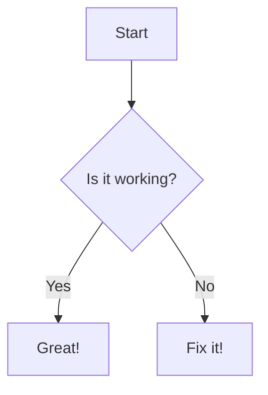

# 📝 Markdown Feature Showcase

This document demonstrates most **standard** and *extended* Markdown capabilities.

---

## 1. Headings

```markdown
# H1
## H2
### H3
#### H4
##### H5
###### H6
```

# H1  
## H2  
### H3  
#### H4  
##### H5  
###### H6  

---

## 2. Text Formatting

- **Bold**: `**Bold**` → **Bold**
- *Italic*: `*Italic*` → *Italic*
- ***Bold + Italic***: `***Bold + Italic***` → ***Bold + Italic***
- ~~Strikethrough~~: `~~Strikethrough~~` → ~~Strikethrough~~
- ==Highlight (if supported)==: `==Highlight==` → ==Highlight==

---

## 3. Lists

### Unordered List
```markdown
- Item 1
  - Nested Item
    - Sub-nested
- Item 2
```

- Item 1  
  - Nested Item  
    - Sub-nested  
- Item 2  

### Ordered List
```markdown
1. First
2. Second
   1. Sub-item
   2. Sub-item
```

1. First  
2. Second  
   1. Sub-item  
   2. Sub-item  

---

## 4. Checkboxes (Task Lists)

```markdown
- [x] Completed task
- [ ] Incomplete task
```

- [x] Completed task  
- [ ] Incomplete task  

---

## 5. Links

```markdown
[OpenAI](https://openai.com)
```

[OpenAI](https://openai.com)

---

## 6. Images

```markdown

```


---

## 7. Code

### Inline Code

```markdown
Use `console.log()` to debug.
```

Use `console.log()` to debug.

### Code Block

<pre>
```javascript
function greet(name) {
  return `Hello, ${name}!`;
}
```
</pre>

```javascript
function greet(name) {
  return `Hello, ${name}!`;
}
```

---

## 8. Blockquote

```markdown
> This is a quote.
>> Nested quote.
```

> This is a quote.  
>> Nested quote.

---

## 9. Horizontal Rule

```markdown
---
```

---

## 10. Tables

```markdown
| Name     | Age | Role     |
|----------|-----|----------|
| Alice    | 24  | Developer|
| Bob      | 27  | Designer |
```

| Name     | Age | Role     |
|----------|-----|----------|
| Alice    | 24  | Developer|
| Bob      | 27  | Designer |

---

## 11. HTML in Markdown

```html
<b>This is bold using HTML</b><br>
<i>Italic HTML</i>
```

<b>This is bold using HTML</b><br>
<i>Italic HTML</i>

---

## 12. Footnotes

```markdown
Here's a sentence with a footnote.[^1]

[^1]: This is the footnote.
```

Here's a sentence with a footnote.[^1]  

[^1]: This is the footnote.

---

## 13. Escaping Characters

```markdown
Use \* to display a literal asterisk (*).
```

Use \* to display a literal asterisk (*).

---

## 14. Emojis

```markdown
:rocket: :sparkles: :tada:
```

:rocket: :sparkles: :tada:

---

## 15. Math (if supported, like in Jupyter/Obsidian)

Inline: `$E = mc^2$` → $E = mc^2$  
Block:

```latex
$$
\int_{a}^{b} f(x)\,dx = F(b) - F(a)
$$
```

$$
\int_{a}^{b} f(x)\,dx = F(b) - F(a)
$$

---

## 16. Mermaid Diagrams (if supported)

<pre>

</pre>


---

## 17. Collapse/Details Block (GitHub-flavored)

<details>
<summary>Click to expand</summary>

Hidden content here!

```bash
echo "Hello!"
```

</details>

---

Happy Writing in Markdown! 🎉
